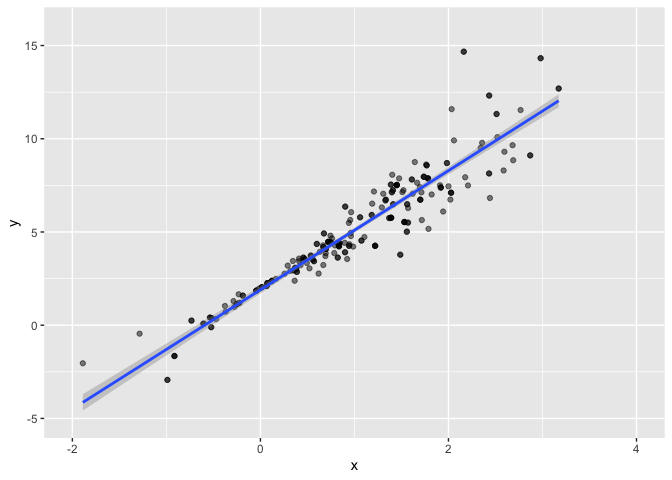

bootstrapping
================
yz5248
2025-11-13

``` r
n_samp = 250

sim_df_const = 
  tibble(
    x = rnorm(n_samp, 1, 1),
    error = rnorm(n_samp, 0, 1),
    y = 2 + 3 * x + error
  )

sim_df_nonconst = sim_df_const |> 
  mutate(
  error = error * .75 * x,
  y = 2 + 3 * x + error
)
```

``` r
sim_df = 
  bind_rows(const = sim_df_const, nonconst = sim_df_nonconst, .id = "data_source") 

sim_df |> 
  ggplot(aes(x = x, y = y)) + 
  geom_point(alpha = .5) +
  stat_smooth(method = "lm") +
  facet_grid(~data_source) 
```

    ## `geom_smooth()` using formula = 'y ~ x'

<!-- -->

look at this data

``` r
sim_df_nonconst |>
  ggplot(aes(x = x, y = y)) +
  geom_point()
```

<!-- -->

``` r
sim_df_const |>
  lm(y ~ x, data = _) |> 
  broom::tidy() |> 
  knitr::kable(digits = 3)
```

| term        | estimate | std.error | statistic | p.value |
|:------------|---------:|----------:|----------:|--------:|
| (Intercept) |    1.977 |     0.098 |    20.157 |       0 |
| x           |    3.045 |     0.070 |    43.537 |       0 |

``` r
sim_df_nonconst |>
  lm(y ~ x, data = _) |> 
  broom::tidy() |> 
  knitr::kable(digits = 3)
```

| term        | estimate | std.error | statistic | p.value |
|:------------|---------:|----------:|----------:|--------:|
| (Intercept) |    1.934 |     0.105 |    18.456 |       0 |
| x           |    3.112 |     0.075 |    41.661 |       0 |

write a function to draw a bootstrap sample

``` r
boot_sample = function(df) {
  sample_frac(df, size = 1, replace = TRUE)
}

# does it work?
sim_df_nonconst |> 
  boot_sample() |> 
  ggplot(aes(x = x, y = y)) + 
  geom_point(alpha = .5) +
  stat_smooth(method = "lm") +
  xlim(c(-2,4)) +
  ylim(c(-5, 16))
```

    ## `geom_smooth()` using formula = 'y ~ x'

<!-- -->

``` r
boot_straps = 
  tibble(
    iter = 1:10
  ) |> 
  mutate(
    bootstrap_sample = map(iter, \(i) boot_sample(df = sim_df_nonconst))
  )

boot_straps
```

    ## # A tibble: 10 × 2
    ##     iter bootstrap_sample  
    ##    <int> <list>            
    ##  1     1 <tibble [250 × 3]>
    ##  2     2 <tibble [250 × 3]>
    ##  3     3 <tibble [250 × 3]>
    ##  4     4 <tibble [250 × 3]>
    ##  5     5 <tibble [250 × 3]>
    ##  6     6 <tibble [250 × 3]>
    ##  7     7 <tibble [250 × 3]>
    ##  8     8 <tibble [250 × 3]>
    ##  9     9 <tibble [250 × 3]>
    ## 10    10 <tibble [250 × 3]>
